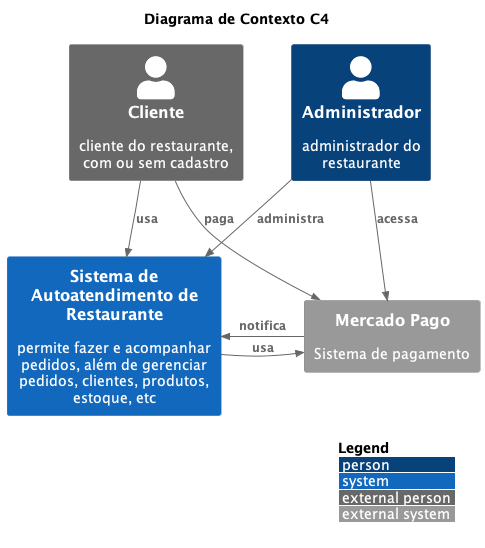

# FIAP 3SOAT Tech Challenge - G15

> **Para o avaliador da Fase 3 ✨**
>
> Queira encontrar todos os entregáveis nos outros repositórios desta organização no GitHub, todos com branches principais protegidas, pipelines para Continuous Integration (CI) e Continuous Delivery (CD) usando GitHub actions, com provisionamento de Infrastructure as Code (IaC) usando Terraform. A justificativa para a escolha do banco de dados foi documentada como Architecture Decision Record (ADR) em [`/docs/adr`](/docs/adr).

Este projeto do curso de Pós-graduação em Arquitetura de Software da FIAP compreende uma solução possível para uma especificação referente a um sistema de autoatendimento de restaurante (do tipo fast-food), com quiosques ou terminais de autoatendimento.

Autores membros do Grupo 15:

- Bleno Humberto Claus
- Giovanni Di Luca Evangelista
- Lucas Gabriel dos Santos
- Mateus Sales Albino
- Wellyson de Freitas Santos

## Requisitos

De forma geral, clientes e administradores usarão o sistema, que depende de um serviço de pagamento externo.



Entre os requisitos não funcionais está a escalabilidade.

[Consulte a documentação](docs/requirements.md) para conhecer todos os requisitos.

## Domain-Driven Development (DDD)

DDD foi a abordagem utilizada para o desenvolvimento, com as seguintes saídas documentadas:

- Glossário ubíquo
- Event storming
- Storytelling
- Mapa de Contexto

[Consulte a documentação](docs/README.md) para saber mais.

## Arquitetura

O sistema expõe uma RESTful API para aplicações front-end, como terminais de autoatendimento para clientes e interfaces para administradores. Tem com dependência um provedor externo de pagamento, o Mercado Pago. As decisões de arquitetura foram devidamente documentadas como Architecture Decision Records (ADRs) em [`/docs/adr`](docs/adr).


[Arquitetura Hexagonal](https://alistair.cockburn.us/hexagonal-architecture) (Ports and Adapters) e Clean Architecture são estritamente adotados no projeto, seguindo o princípio de Separation of Concerns.

## Tecnologia

Este é um projeto para JVM. Foi implementado em [Kotlin](https://kotlinlang.org) usando o [Maven](https://maven.apache.org) como gerenciador de dependências. Fora da camada de domínio algumas bibliotecas foram utilizadas, incluindo:

- [Spring Framework](https://spring.io) como base do projeto
- [MapStruct](https://mapstruct.org) para mapeamento entre objetos (ex.: entity para model)
- [Flyway](https://flywaydb.org) para migrações de BD, permitindo [design evolutivo](https://martinfowler.com/articles/evodb.html)
- [Hibernate](https://hibernate.org) para mapeamento objeto-relacional

## Mercado Pago

Essa aplicação está integrada com o Mercado Pago, um provedor de pagamento. Com a realização do pedido, um QR code é criado num ponto de venda ("Point of Sale" ou "POS") da loja para ser pago pelo cliente através do aplicativo do Mercado Pago. Após o pagamento, o Mercado Pago notifica a aplicação através de um endpoint funcionando como webhook.

O fluxo de pagamento pode ser esquematizado no seguinte diagrama de sequência:


[Consulte a documentação](/docs/mercado-pago.md) para saber mais sobre a integração.

## Banco de Dados

O seguinte modelo de Entidade Relacionamento foi desenvolvido:


## Infraestrutura

Amazon Web Services (AWS) é usado como Cloud Provider e o Terraform é usado para provisionar Infrastructure as Code (IaC) hospedado neste repositório em [`/terraform`](terraform) e nos demais repositórios desta organização no GitHub.

Os recursos incluem:

- repositório privado no Amazon Elastic Container Registry (ECR)
- cluster do Amazon Elastic Kubernetes Service (EKS)
- instância do Relational Database Service (RDS) for PostgreSQL
- secrets (de banco de dados e Mercado Pago) no Secrets Manager
- parâmetros de sistema no SSM Parameter Store
- API Gateway (Load Balancer no EKS como target)
- user pool de clientes no Cognito
- funções Lambda para autenticação

Além de dependências como recursos do Virtual Private Cloud (VPC).


## CI / CD

Pipelines foram configuradas usando o [GitHub Actions](https://github.com/features/actions).

Neste repositório existem as seguintes pipelines:

- **app:** build, verificação, publicação da imagem no ECR
- **docs:** geração e publicação do website de documentação com [MkDocs](https://www.mkdocs.org/)
- **openapi:** geração OpenAPI em JSON e sincronização com Postman API
- **provisioning:** provisionamento de IaC na AWS com Terraform

As imagens e containers Docker utilizados para implementação das pipelines podem ser verificados no [Makefile](Makefile).

## Documentação

Consulte a documentação em [`/docs`](docs) ou acesse:

[http://fiap-3soat-g15.s3-website-us-east-1.amazonaws.com](http://fiap-3soat-g15.s3-website-us-east-1.amazonaws.com/)

A especificação **OpenAPI (Swagger)** em formato JSON também é publicado:

[http://fiap-3soat-g15.s3-website-us-east-1.amazonaws.com/openapi.json](http://fiap-3soat-g15.s3-website-us-east-1.amazonaws.com/openapi.json)

Com a aplicação em execução, você tambem pode acessar o Swagger UI:

[http://localhost:8080/swagger-ui/index.html](http://localhost:8080/swagger-ui/index.html)

Preview:


## Postman collection

Acesse a API sincronizada no Postman:

[Postman API](https://fiap-3soat-g15.postman.co/workspace/tech-challenge~febf1412-7ce2-4cb4-8bca-50f4fdd3a479/api/c77ec61d-c410-443e-92f7-c204be16083b?action=share&creator=12986472)

Uma collection sincronizada também fica disponível em:

[docs/postman-collection.json](docs/postman-collection.json)

Use o seguinte token como header `x-admin-token` para testar endpoints `/admin/**`:

```
token
```

## Como executar localmente

A forma mais simples é utilizando o [Docker Compose](https://docs.docker.com/compose):

```bash
docker compose up
```

## Desenvolvimento

### Mappers

[MapStruct](https://mapstruct.org) é usado para mapear entities e models e implementaçōes para os mappers anotados com `@Mapper` são geradas em tempo de compilação:

```
mvn clean compile
```

### Testes

```
mvn clean verify
```

Para incluir os testes de integração:

```
mvn clean verify -DskipITs=false
```

### ktlint

```
mvn antrun:run@ktlint-format
```

### Kubernetes local

```
minikube start
```

Consulte: https://kubernetes.io/docs/tasks/tools

### Imagem no Minikube

Crie a imagem local com o mesmo nome da imagem remota.

Exemplo com macOS:

```
eval $(minikube docker-env)
docker build -t 202062340677.dkr.ecr.us-east-1.amazonaws.com/tech-challenge:latest .
```

Consulte: https://minikube.sigs.k8s.io/docs/handbook/pushing

### ngrok

Para expor a aplicação local externalmente:

```
ngrok http http://localhost:8080
```

Acesse o endereço de redirecionamento ("forwarding").
