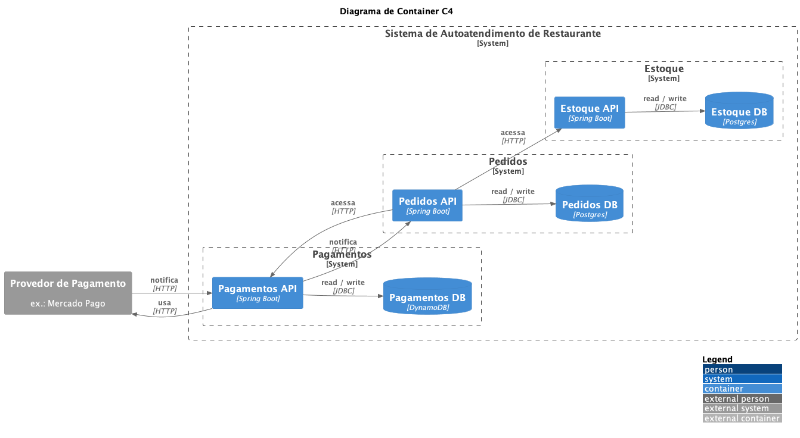

# FIAP 3SOAT Tech Challenge - G15

Este projeto do curso de Pós-graduação em Arquitetura de Software da FIAP compreende uma solução possível para uma especificação referente a um sistema de autoatendimento de restaurante (do tipo fast-food), com quiosques ou terminais de autoatendimento.

Autores membros do Grupo 15:

- Bleno Humberto Claus
- Giovanni Di Luca Evangelista
- Lucas Gabriel dos Santos
- Mateus Sales Albino
- Wellyson de Freitas Santos

## Requisitos

De forma geral, clientes e administradores usarão o sistema, que depende de um serviço de pagamento externo.

Entre os requisitos não funcionais está a escalabilidade.

[Consulte a documentação](docs/requirements.md) para conhecer todos os requisitos.

## Domain-Driven Development (DDD)

DDD foi a abordagem utilizada para o desenvolvimento, com as seguintes saídas documentadas:

- Glossário ubíquo
- Event storming
- Storytelling
- Mapa de Contexto

[Consulte a documentação](docs/README.md) para saber mais.

## Arquitetura

O sistema expõe RESTful APIs para aplicações front-end, como terminais de autoatendimento para clientes e interfaces para administradores. Tem com dependência um provedor externo de pagamento, como o Mercado Pago. As decisões de arquitetura foram devidamente documentadas como Architecture Decision Records (ADRs) em [`/docs/adr`](docs/adr).

[Arquitetura Hexagonal](https://alistair.cockburn.us/hexagonal-architecture) (Ports and Adapters) e Clean Architecture são estritamente adotados no projeto.

## Mercado Pago

Essa aplicação está integrada com o Mercado Pago, um provedor de pagamento. Com a realização do pedido, um QR code é criado num ponto de venda ("Point of Sale" ou "POS") da loja para ser pago pelo cliente através do aplicativo do Mercado Pago. Após o pagamento, o Mercado Pago notifica a aplicação através de um endpoint funcionando como webhook.

[Consulte a documentação](/docs/mercado-pago.md) para saber mais sobre a integração.

## Infraestrutura

Amazon Web Services (AWS) é usado como Cloud Provider e o Terraform é usado para provisionar Infrastructure as Code (IaC) hospedado neste repositório em [`/terraform`](terraform) e nos demais repositórios desta organização no GitHub.

Os recursos incluem:

- repositórios privados no Amazon Elastic Container Registry (ECR)
- cluster do Amazon Elastic Kubernetes Service (EKS)
- instâncias do Relational Database Service (RDS) for PostgreSQL
- tabela do DynamoDB
- secrets (de banco de dados e Mercado Pago) no Secrets Manager
- parâmetros de sistema no SSM Parameter Store
- API Gateway (Load Balancer no EKS como target)
- user pool de clientes no Cognito
- funções Lambda para autenticação

Além de dependências como recursos do Virtual Private Cloud (VPC).
