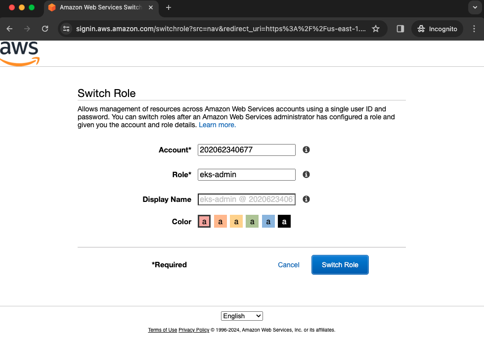

# AWS

## Elastic Kubernetes Service (EKS)

Usamos o EKS para subir nosso cluster do Kubernetes na nuvem da AWS.

Existe uma AWS role com permissão para ver os detalhes do cluster no console chamada `eks-admin`.

Você pode assumir essa role diretamente do console ("Switch Role" no menu do canto superior direito):



Ou você pode usar o AWS CLI para executar comandos `kubectl` no cluster da seguinte forma:

### 1. Faça login como usuário na conta AWS

Faça login na conta da AWS com usuário que faça parte do grupo `eks-admin` (peça ao administrador da conta AWS para criar uma conta de usuário para você).

### 2. Access e secret access key

Crie o access key e o secret access key no [console](https://us-east-1.console.aws.amazon.com/iam/home#/security_credentials).

### 3. Configure as credentials na sua máquina

Configure os profiles do seu usuário e da role `eks-admin` localmente em `~/.aws/credentials`:

```text
[fiap-3soat-g15-user]
aws_access_key_id     = **************
aws_secret_access_key = **************
region                = sa-east-1

[fiap-3soat-g15-eks-admin]
role_arn = arn:aws:iam::202062340677:role/eks-admin
source_profile = fiap-3soat-g15-user
```

Verifique os profiles:

```bash
aws sts get-caller-identity --profile fiap-3soat-g15-eks-user
```

Retorno:

```text
{
    "UserId": "*****************",
    "Account": "202062340677",
    "Arn": "arn:aws:iam::202062340677:user/your_user"
}
```

```bash
aws sts get-caller-identity --profile fiap-3soat-g15-eks-admin
```

```text
{
    "UserId": "*************:botocore-session-**********",
    "Account": "202062340677",
    "Arn": "arn:aws:sts::202062340677:assumed-role/eks-admin/botocore-session-**********"
}
```

### 4. Atualize o kubeconfig

```bash
aws eks update-kubeconfig --name fiap-3soat-g15 --region sa-east-1 --profile fiap-3soat-g15-eks-admin
```

### 5. Execute kubectl

Pronto, você já pode executar os comandos no cluster remoto.

Faça um teste:

```
kubectl auth can-i "*" "*"
```
