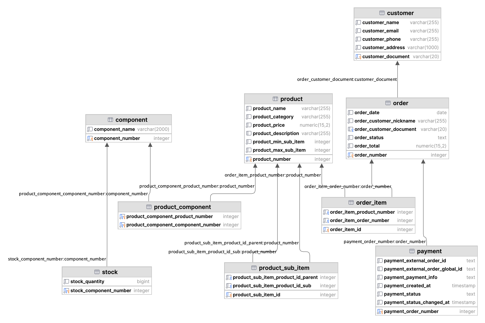

# Banco de Dados

## Diagrama de Entidade e Relacionamento

## Schema

## Overview das tabelas

### Componente

Componentes de produtos.

Exemplo: pão é um componente de um cheeseburger.

### Estoque

Quantidade de componentes em estoque.

Apenas um atributo inteiro é utilizado para simplificação, mas unidades de medida deveriam ser levadas em consideração em sistemas reais.

### Produto-componente

Relaciona componentes com produtos.

Semelhante ao caso anterior, a quantidade da associação nem unidades de medida são considerada para simplificação.

### Produto

Produtos, que podem ser combos incluindo outros produtos (subitens) determinados na tabela de produto-subitem, com uma quantidade mínima e máxima para os pedidos.

Categoria é um atributo de produto porque as opções são poucas e estáticas,sem necessidade de uma tabela de categoria. Isso, porém, poderia ser facilmente implementado.

### Produto-subitem

Relação entre produto-pai e produto-filho para combos.

### Pedido

Pedido, composto por vários itens de pedidos.

### Item de pedido (order line)

Cada produto que compõe o pedido.

Atualmente, produtos iguais são adicionados separadamente. Um ponto de melhoria seria armazenar a quantidade e o preço (para armazenar o preço histórico do produto, que pode variar ao longo do tempo). Neste caso, se trataria mais de linhas de pedido (order lines).

## Pagamento

Status de pagamento atrelado a pedido, para integração com provedor externo de pagamento.
