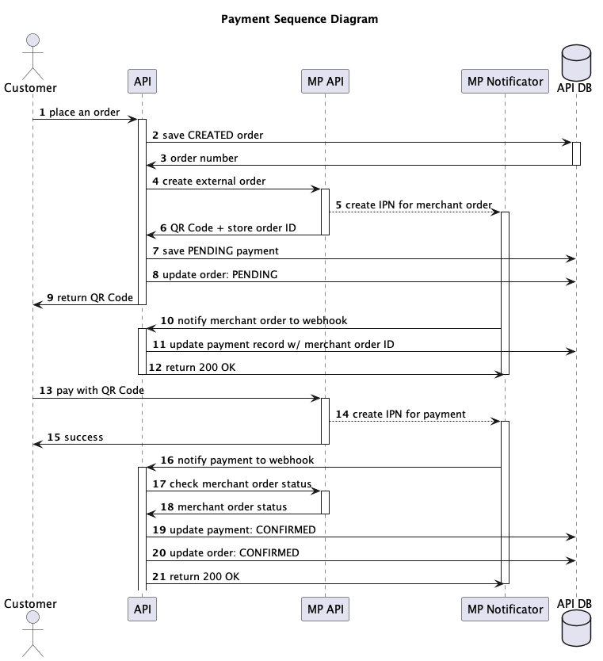

# Mercado Pago

Essa aplicação está integrada com o Mercado Pago, um provedor de pagamento. Com a realização do pedido, um QR code é criado num ponto de venda ("Point of Sale" ou "POS") da loja para ser pago pelo cliente através do aplicativo do Mercado Pago. Após o pagamento, o Mercado Pago notifica a aplicação através de um endpoint funcionando como webhook.



O webhook exposto é `/payments/notifications/{orderNumber}`, e aceita notificações do Mercado Pago do tipo Instant Payment Notification (IPN), assinadas com header `x-signature`. A validação da assinatura, conforme documentação do Mercado Pago, não foi implementada por simplificação.

## Configuração e testes

Contas de teste de vendedor e comprador podem ser usados para teste, bem como cartões de crédito de teste. Para configurar e testar a aplicação usando o Mercado Pago, siga os seguintes passos.

### 1. Crie uma conta no Mercado Pago

Uma conta real no Mercado Pago é necessária.

Confirmação de documentos é obrigatório.

### 2. Criar aplicação

Acesse o [painel do desenvolvedor](https://www.mercadopago.com.br/developers/panel/app) e cria uma aplicação usando "Pagos presencial" e "CódigoQR" no modelo de integração "Dinâmico".


### 3. Criar contas de teste

Crie duas contas de teste, uma como **vendedor** e outra como **comprador**.

No caso do comprador, você pode configurar um saldo inicial para pagamentos posteriores (ou deixar para pagar com os cartões de teste também disponibilizados no painel do desenvolvedor).


### 4. Criar aplicação de teste

Faça login na conta de teste de **vendedor**.

Nesta conta de teste, crie uma nova aplicação da mesma forma como criado anteriormente.


Esta aplicação será a aplicação de teste.

### 5. Obter credenciais de teste

No painel do desenvolvedor, procure pelo `User ID`.


Em credenciais de teste, procure pelo access token.


### 6. Criar loja

Usando o `User ID` e o access token obtidos anteriormente, faça uma requisição para criar uma loja no [endpoint `POST /users/{userId}/stores`](https://www.mercadopago.com.br/developers/pt/reference/stores/_users_user_id_stores/post).

```
curl -X POST 'https://api.mercadopago.com/users/{userId}/stores' \
-H 'Content-Type: application/json' \
-H 'Authorization: Bearer TEST-344********79723-01********6df35576********994e704d********9641402' \
-d '{
    "name": "Store for tests",
    "location": {
        "street_name": "Av. Lins de Vasconcelos",
        "street_number": "1222",
        "city_name": "São Paulo",
        "state_name": "São Paulo",
        "latitude": -23.5741903,
        "longitude": -46.6235053,
        "reference": null
    }
}'
```

Exemplo de resposta:

```
{
    "id": "12345678",
    "name": "Store for tests",
    "date_creation": "2024-01-26T07:40:41.079Z",
    "location": {
        "address_line": "Av. Lins de Vasconcelos 1222, São Paulo, São Paulo, Brasil",
        "latitude": -23.5741903,
        "longitude": -46.6235053,
        "id": "BR-SP-44",
        "type": "city",
        "city": "São Paulo",
        "state_id": "BR-SP"
    }
}
```

### 7. Criar caixa da loja

Semelhantemente, usando o ID da loja da resposta anterior, faça uma requisição para criar um caixa da loja (também chamado "POS" ou "Point of Sale") no [endpoint `POST /pos`](https://www.mercadopago.com.br/developers/pt/reference/pos/_pos/post).

```
curl -X POST 'https://api.mercadopago.com/pos' \
-H 'Content-Type: application/json' \
-H 'Authorization: Bearer TEST-344********79723-01********6df35576********994e704d********9641402' \
-d '{
    "name": "POS for tests",
    "store_id": 12345678,
    "external_id": "POS4TEST",
    "fixed_amount": false
}'
```

### 8. Configure a aplicação

Injete as informações necessárias para que a aplicação possa funcionar corretamente:

- access token
- user ID
- POS ID (`external_id`)

Você pode fazer isso através do arquivo `src/main/resources/application.yml`.

Note também que é preciso informar uma URL base para o webhook. Em produção, essa URL será a mesma da aplicação esposta na internet. Em testes, você pode usar um túnel com [ngrok](https://ngrok.com) ou outra ferramenta do tipo.

### 9. Gerar imagem do QR Code

Você pode usar ferramentas online para gerar o QR Code com os dados retornados pelo Mercado Pago para a aplicação.

Exemplo de gerador de QR Code: [https://www.qr-code-generator.com](https://www.qr-code-generator.com)

> Atenção: o QR code gerado precisa ser lido pelo aplicativo do Mercado Pago para realização de pagamento.

### 10. Pagar com QR Code

No aplicativo do Mercado Pago, faça login com a conta de teste como comprador.

Leia o QR Code e realize o pagamento usando o saldo disponível ou um dos cartões de teste disponibilizado no painel do desenvolvedor.

> Atenção: o pagamento não pode ser realizado pela mesma conta de vendedor que foi usada para criar o QR code.
